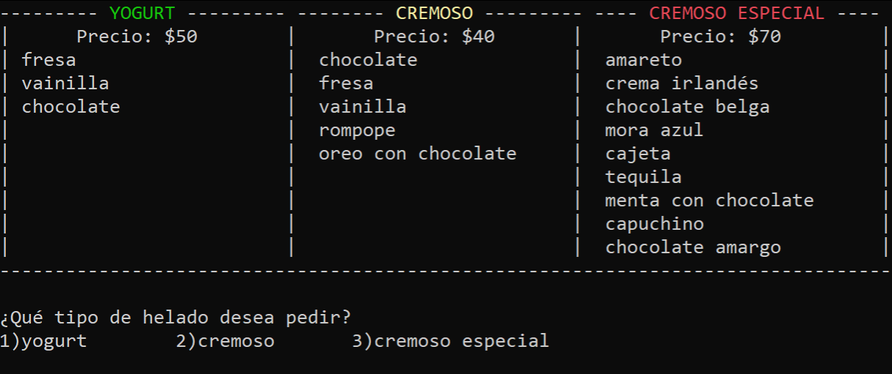

# Heladería :icecream:

  

## Listado de programas:

- ## [_Archivo.py_](Archivo.py)

  ### " Contenido del programa "

  En este programa definí funciones para:

  - Crear archivos:

    A esta función le paso como parametro una "ruta", que en este caso es el nombre del archivo que deseo crear, ya que dicho archivo se creeara en la misma carpeta donde se encuentra el programa. Por medio de un try-except compruebo si dicho archivo ya ha sido previamente creado o no, es decir, dentro del try mando a crear el archivo y si todo sale bien nos imprimirá un mensaje diciendo que se ha creado con exito dicho archivo, en caso contario entrara en el except de `FileExistError` el cual indica que ya ha sido creado dicho archivo.

    

     
    

  - Comprobar si un archivo esta vacío:

    A esta función le paso como parametro una "ruta", que en este caso es el nombre del archivo que deseo saber si esta vacío. En dicha funcion utilizo el metodo seek, el cual recibe dos parametros, el primero es el desplazamiento y el segundo es desde donde, en este caso `file.seek(0,os.SEEK_END)` lo que esta haciendo es desplazarse cero caracteres desde el final del archivo, por lo tanto el puntero del archivo queda al final, posteriormente el metodo tell nos devuelve la posición actual del puntero de dicho archivo, por lo que si el puntero se encuentra apuntando al comienzo del archivo devolvera un cero, que es igual a "False", esto quiere decir que el archivo esta vacío.

  - Leer datos de un archivo:

    A esta función le paso como parametro una "ruta", que en este caso es el nombre del archivo que deseo leer. En dicha función compruebo si el archivo esta vacío, de no ser así, utilizará el modulo json para ocupar el metodo load el cual carga los datos contenidos de dicho archivo y los devuelve para poder guardarlos en una variable.

    

  - Agregar datos a un archivo:

    A esta función le paso como parametro una "ruta", que en este caso es el nombre del archivo donde deseo escribir. En dicha función utilizo el modulo json para ocupar el metodo dump el cual escribe los datos contenidos en una variable hacia el archivo.

- ## [_Funciones.py_](Funciones.py)

  ### " Contenido del programa "

  En este programa definí funciones para:

  - Imprimir el titulo de la heladeria:

    El título lo realice en dos partes con algunos comandos de linux.

    Para hacer el pingüino utilice:

    `cowsay -f tux "texto"`

    Y para el título utilice:

    `figlet "texto"`

  - Imprimir el menu de los 3 tipos de helado

    Para imprimir este menu guarde todos los sabores de los distintos tipo de helados en listas y posteriormente con un for mande a imprimir dichos sabores.

    

  - Imprimir el menu de los sabores del helado de yogurt

    Para imprimir este menu guarde todos los sabores del helado de yogurt en una lista y posteriormente con un for mande a imprimir dichos sabores.

    

  - Imprimir el menu de los sabores del healdo cremoso

    Para imprimir este menu guarde todos los sabores del helado de cremoso en una lista y posteriormente con un for mande a imprimir dichos sabores.

    

  - Imprimir el menu de los sabores del helado cremoso especial

    Para imprimir este menu guarde todos los sabores del helado de cremoso especial en una lista y posteriormente con un for mande a imprimir dichos sabores.

    

  - Imprimir el menu de los envases

    Para imprimir este menu guarde todos los envases en una lista y posteriormente con un for mande a imprimir dichos envases.

    

  - Imprimir el menu de los toppings

    Para imprimir este menu guarde todos los sabores de toppings en una lista y posteriormente con un for mande a imprimir dichos sabores.

    

  - Leer orden:

    En esta función declare un diccionario llamado "_cont_tipo_helado_", el cual voy a ocupar para contar las veces que es pedido un sabor de cualquier tipo de helado.
    Tambien declare una variable llamada "_pedir_" de tipo boolena la cual me ayudará a hacer valido mi ciclo while más adelante, y por ultimo declare una lista llamada "_orden_" en la cual almacenaré el nombre del usuario y los helados que vaya pidiendo.
    Posteriormente le pregunto su nombre al usuario y entra en el ciclo while, mientras "_pedir_" sea "_True_" le va a preguntar al usuario si desea ordenar algo, en caso de que deje la orden vacía "_pedir_" será igual a "_False_" y saldrá del ciclo, de lo contrario tomará su orden llamando a la función helado, la cual recibe el dicccionario "_cont_tipo_helado_" y regresa un diccionario "_cont_tipo_helado_" y aparte regresa otro diccionario donde se almacena: el tipo de helado, el o los sabores, el tipo de envase, los toppings (en caso de haya) y el precio por orden, este diccionario lo guardo en una variable llamada "_orden_hecha_".
    Luego agrego el diccionario "_orden_hecha_" a la lista llamada "_orden_" y finalmente agrego el nombre del usuario a la misma lista.
    Esta función regresa la lista "_orden_" y el dicccionario "_cont_tipo_helado_".

  - Helado:

    Esta función recibe como parametro un dicccionario llamado "_cont_tipo_helado_", el cual voy a ocupar para contar las veces que es pedido un sabor de cualquier tipo de helado.
    Dentro de la función declare:

    - un diccionario llamado "_helado_", en el cual almacenare las caracteristicas de la orden

    - una lista llamada "_sabores_", donde almacenare los sabores del helado que pida el usuario

    - una lista llamda "_toppings_", donde almacenare los toppings que pida el usuario,

    - una variable "_total_", donde ire sumando los precios de cada cosa de la orden

    - una variable "_tope_bls_", donde le defino el número de bolas máximo

    - una variable "_k_", la cual me servira de contador más adelante

    Procedimiento en que se va registrando la orden:

    1. Se le pregunta al usuario que tipo de helado va a querer y en base a eso imprime el menu del tipo de helado y define el precio del mismo, además agrega al diccionario "_helado_" el tipo de helado que se pidio.

    

    2. Se le pregunta al usuario cuántas bolas de helado va a querer, dependiendo del número de bolas que pida el usuario será el número de sabores que habrá en la lista "_sabores_", ya que cada sabor se va agregando a dicha lista y se va sumando el precio por bola al total de la orden, al finalizar la selección de sabores, dicha lista se agrega al diccionario "_helado_".

    

    3. Se le pregunta en que envase desea llevar su helado, dependiendo del envase que elija, esté se agregará al diccionario "_helado_" y se sumará su respectivo precio.

    

    4. Se le pregunta al usuario si desea poner algún topping a su helado, en caso de que no elija ninguna cubierta se saldra de la función y retornará el diccionario "_helado_" con las caracteristicas de la orden y el diccionario "_cont_tipo_helado_", el cuál sirve para ir contando que sabor pide el usuario para posteriormente calcular la popularidad de los helados. En caso de que elija algún topping se sumará el respectivo precio a el total y se agregará el sabor a la lista de "_toppings_", la cuál al finalizar la selección de sabores, se agregará al diccionario "_helado_".

    

  - Imprime orden:

    Esta función recibe la lista "_orden_", la cual es una lista que contiene el nombre del usuario y un diccionario con las caracteristicas del helado que pidio. Mediante un for se imprime el contenido del diccionario para así poder visualizar la orden.

    

  - Imprime popularidad:

    Esta función recibe el diccionario "_cont_tipo_helado_" y en base a el contador de cada sabor se ordena el diccionario de manera ascendente con su repectiva clave, que en este caso es el sabor del helado y mediante un for se imprime todo el contenido de dicho diccionario.

    

  - Imprime historial:

    Esta función recibe una lista "_historial_" que contiene todas las ordenes hechas y mediante un for en base con el historial se llama a la función "_imprime_orden_" y se imprime cada elemento de la lista "_historial_".

    

- ## [_Heladeria.py_](Heladeria.py)

  ### " Contenido del programa "

  Este programa es el "principal", donde por medio de un import mando a llamar las funciones de los dos archivos _.py_ anteriormente mencionados.
  En este programa definí una función llamada Menu en la que le pregunto al usuario que acción quiere realizar, ya sea:

  - Ordenar

  - Imprimir el historial de ordenes

  - Calcular la popularidad

  - Salir del programa

  

  Y en base a la opción seleccionada se llamará a la función desarrollada para realizar dicha acción
